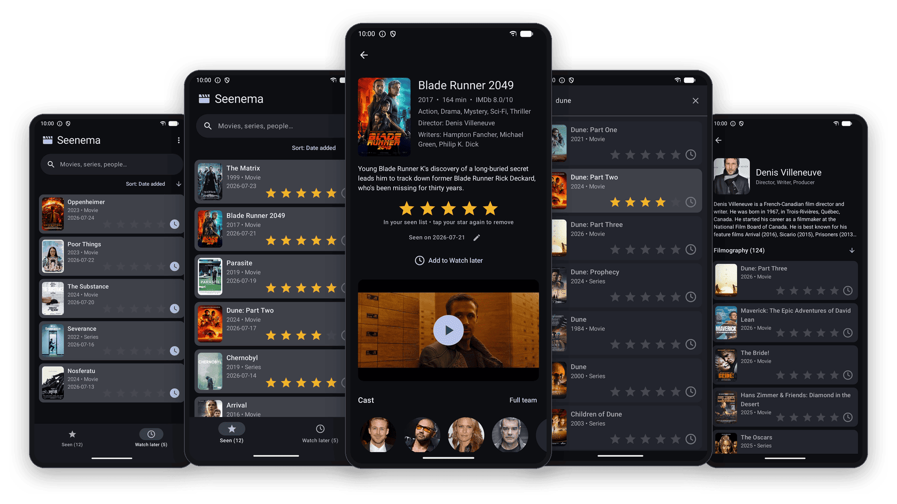

  

<h1 align="center">Seenema: Movie Tracker</h1>

  Track the films and series you have watched, rate them, and keep a list of what to watch next. 
  No account, no ads, no tracking, locally saved.

  

  

## Features

- 🔍 **Search** films, series and people.
- ⭐ **Rate in one tap** a film or a series to add it to your seen list.
- 🕐 **Watch later** saves anything for later, and it moves over to your seen list once you rate it.
- 🎞️ **Title pages** with the synopsis, IMDb score, cast, complete crew, and trailer, which plays in the app.
- 👤 **People pages** with their full filmography.
- 📝 **Notes** field to add a personal note and the date you watched something.
- 📄 **Backup** is easy with a plain CSV file on your phone, not an account somewhere.

Everything sits in `Android/media/sitavi.seenema/seenema.csv`. "Share CSV" in the top-right menu exports it and "Import CSV" brings it back, which is how you move to a new phone or restore a backup.

> ⚠️ Android deletes that folder when the app is uninstalled, so regular backups are recommended.
